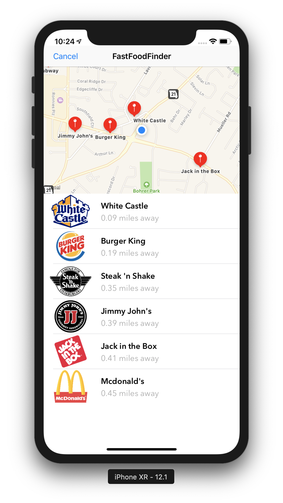
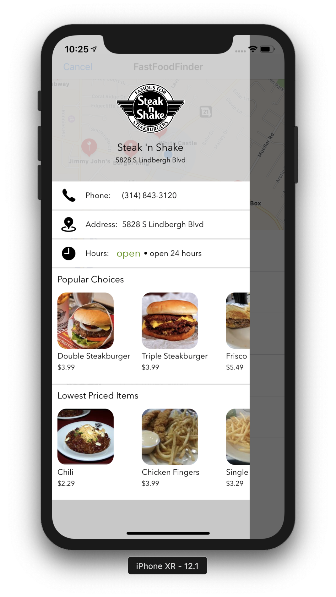
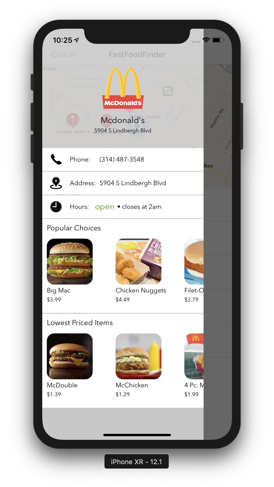
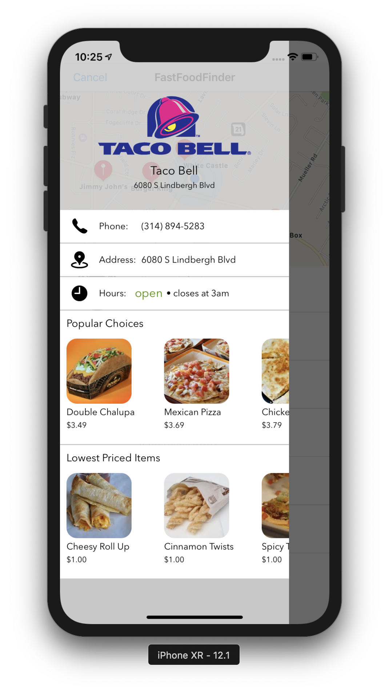

# iOS-fastfood-finder
Find local food quickly with the help of Mapkit and CLLocation.

## Summary
Immediately find the ten closest fast food places based on your location, as well as their top products, prices, and closing times. This app grabs your zip code from your GPS coordinates, it then makes an API call to find every fast food restaurant in that zip code. It then calculates the ten closest restaurants to your location and lists them in sequential order.

## Author
* Matthew Cassell
